<br><br>

<!-- project philosophy -->


> Workwise is a platform that uses AI to help people grow in their careers. It offers personalized learning paths, mock interview practice, and a community for support.
>
> The project’s goal is to make it easier for people to advance in their jobs by providing AI-Enhanced learning plans, realistic interview experiences, and a supportive place for networking, mentorship, and skill building. We want to make learning and career growth more accessible, engaging, and effective for everyone.

## User Stories

### User

- As a user, I want to create a personalized learning plan and track the progress, so I can work towards my career goals step by step.
- As a user, I want to participate in mock interviews with AI or Moderator, so I can practice and improve my interview skills.
- As a user, I want to join a community, so I can collaborate with like-minded individuals and gain mentorship.

### Moderator

- As a moderator, I want to check the pending invitations that are sent to me for mock interviews
- As a moderator, I want to give a detailed feedback after each interview is completed, and I want to accept or reject interviews invitations.
- As a moderator, I am designated as the person users conduct interviews with in the community, ensuring that I can actively support their preparation and provide valuable feedback.

### Admin

- As an admin, I want to assign moderator roles to community members, so I can ensure the community is actively managed and moderated.
- As an admin, I want to create new channels within the community, so users can engage in focused discussions based on specific topics or interests.
- As an admin, I want to edit community details, such as the name, description, or rules, so I can keep the community's information accurate and up-to-date.

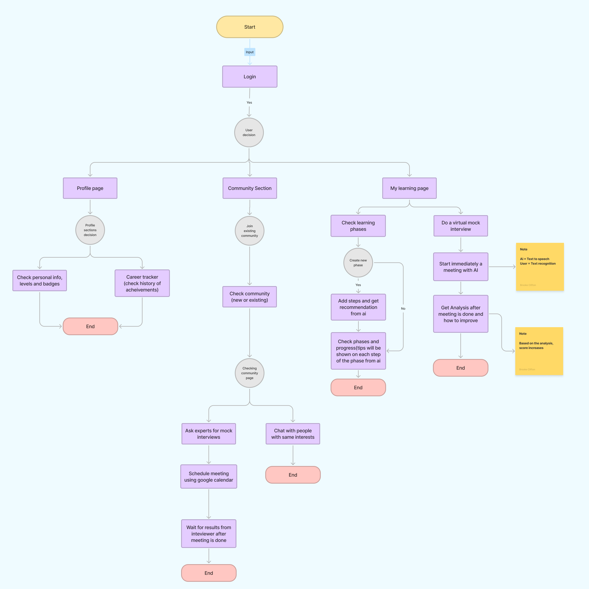

<br><br>

<!-- Tech stack -->


### WorkWise is built using the following technologies:

- The project uses [ReactJS](https://react.dev/) for the frontend, enabling an interactive and dynamic user interface.
- For the backend server, it utilizes [Node.js](https://nodejs.org/en) with [Express.js](https://expressjs.com/), providing a robust and scalable API.
- The platform relies on [MySQL](https://www.mysql.com/) for relational database management, ensuring efficient data storage and retrieval.
- For real-time features, the project integrates [Socket.io](https://socket.io/), enabling live notifications and updates across the platform.
- Advanced 3D visualizations are powered by [Three.js](https://threejs.org/), offering immersive and interactive experiences.
- Seamless video conferencing capabilities are achieved using [Daily.js](https://www.daily.co/).
- The design of user-friendly and consistent UI components is handled by [MUI (Material-UI)](https://mui.com/).
- File uploads are managed efficiently with [Multer](https://github.com/expressjs/multer) middleware.
- Secure user authentication and authorization are ensured using [JWT](https://jwt.io/) (JSON Web Tokens).
- Database management and interaction are simplified with [Prisma ORM](https://www.prisma.io/).
- Natural and realistic voice outputs are generated using [ElevenLabs](https://elevenlabs.io/).
- Speech recognition and voice interaction are enabled with the [Web Speech API](https://developer.mozilla.org/en-US/docs/Web/API/Web_Speech_API).
- AI-driven features like content generation and interactive learning are powered by [OpenAI](https://openai.com/).
  <br><br>

<!-- UI UX -->


> WorkWise started as simple wireframes and mockups. We kept refining the design, taking feedback at every step, until it felt just right to use, fun to navigate, and perfectly suited to help users grow their careers.

- Project Figma design [figma](https://www.figma.com/design/zplq3EtGiAvkY5so23DcGL/WorkWise-Wireframes?node-id=0-1&t=DDK6dIZuo9VDnyA6-1)

### Mockups

| My Interviews screen                                    | Profile Screen                               |
| ------------------------------------------------------- | -------------------------------------------- |
| 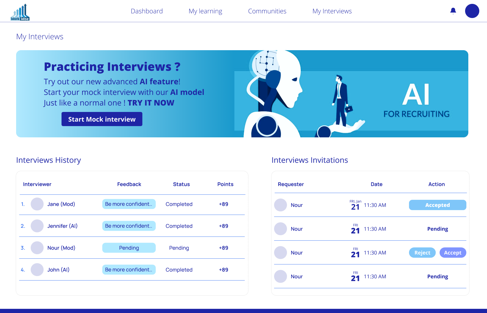 | 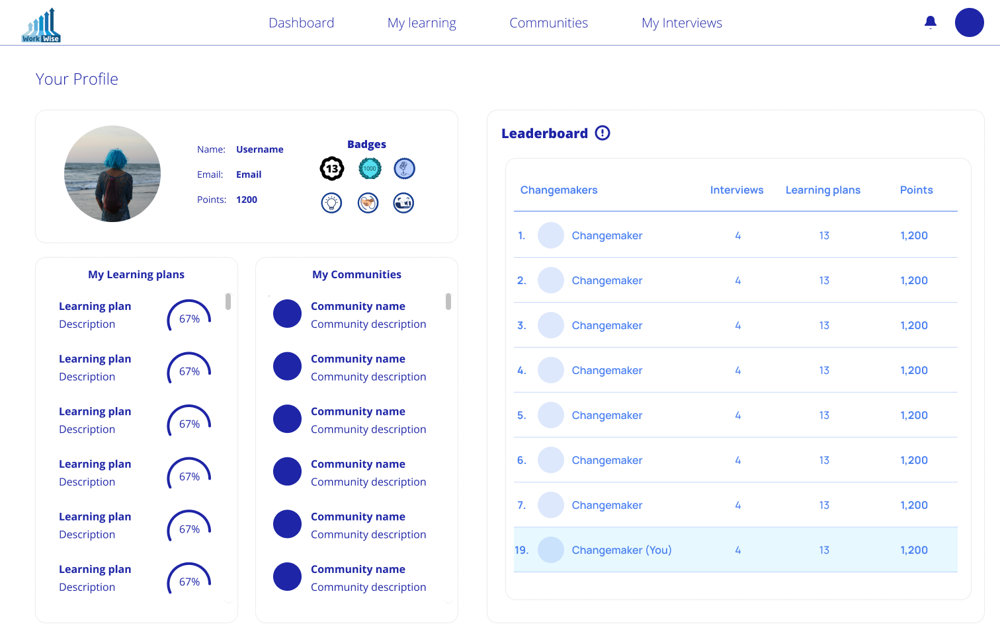 |

<br><br>

<!-- Database Design -->


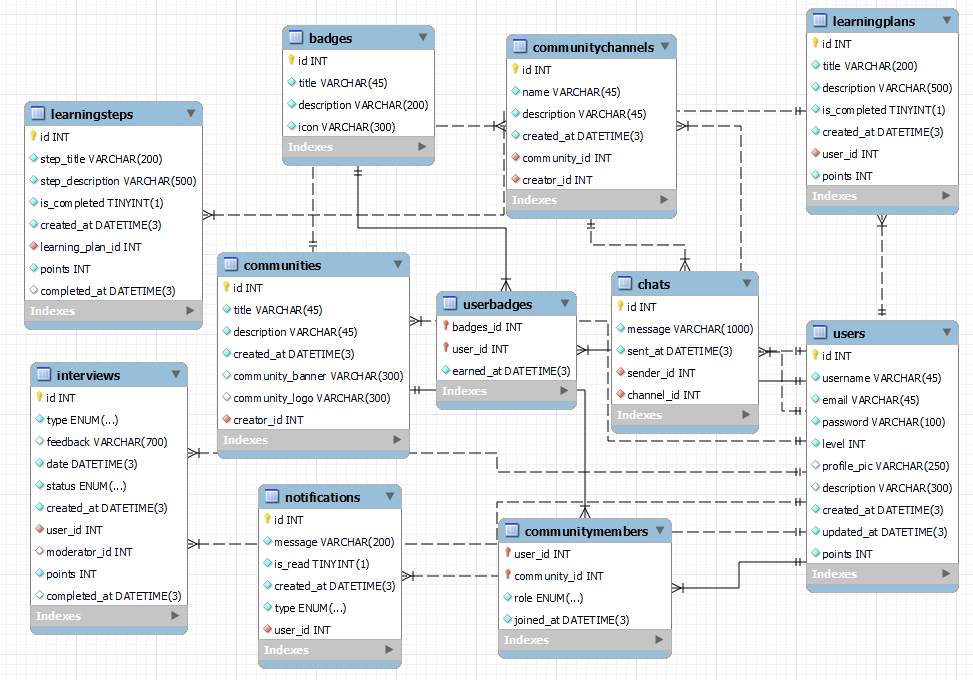

<br><br>

<!-- Implementation -->


### User Screens

| AI Interview screen                                | Communities screen                                   |
| -------------------------------------------------- | ---------------------------------------------------- |
| 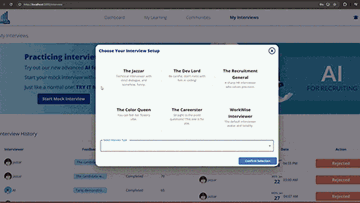  | 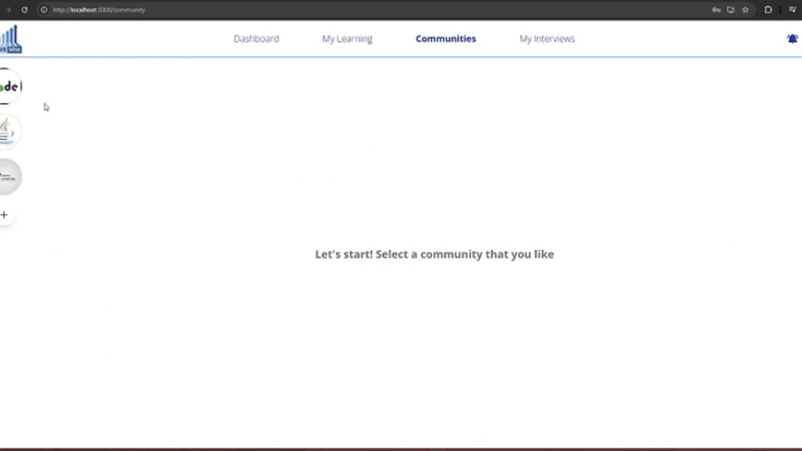  |
| Dashboard screen                                   | My Interviews Screen                                 |
| 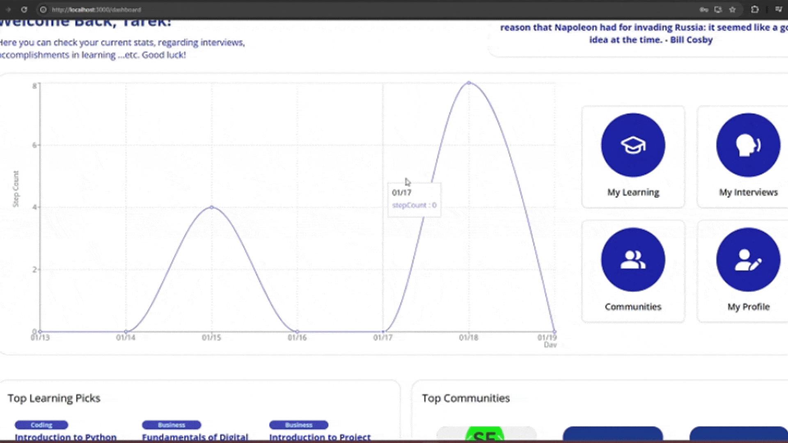 | 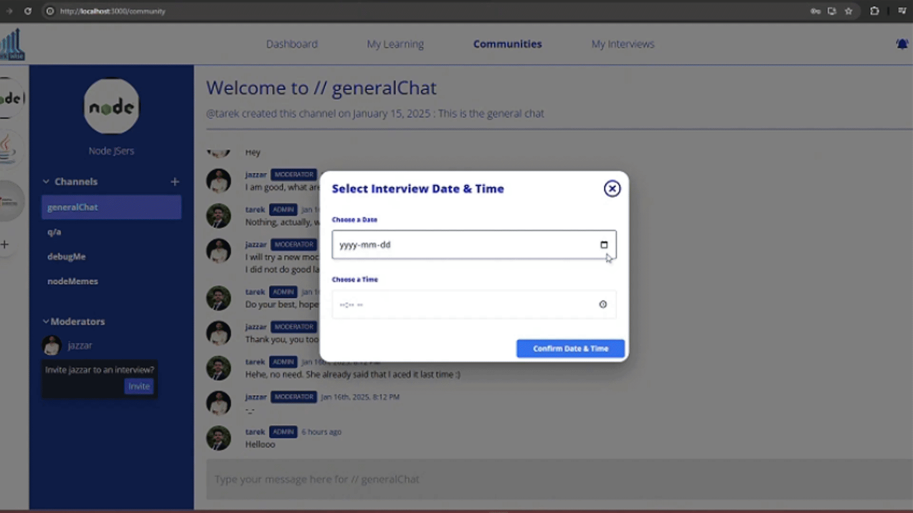 |
| My Learning screen                                 | Video Call Screen                                    |
| 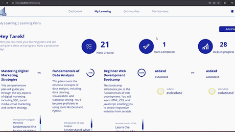  | 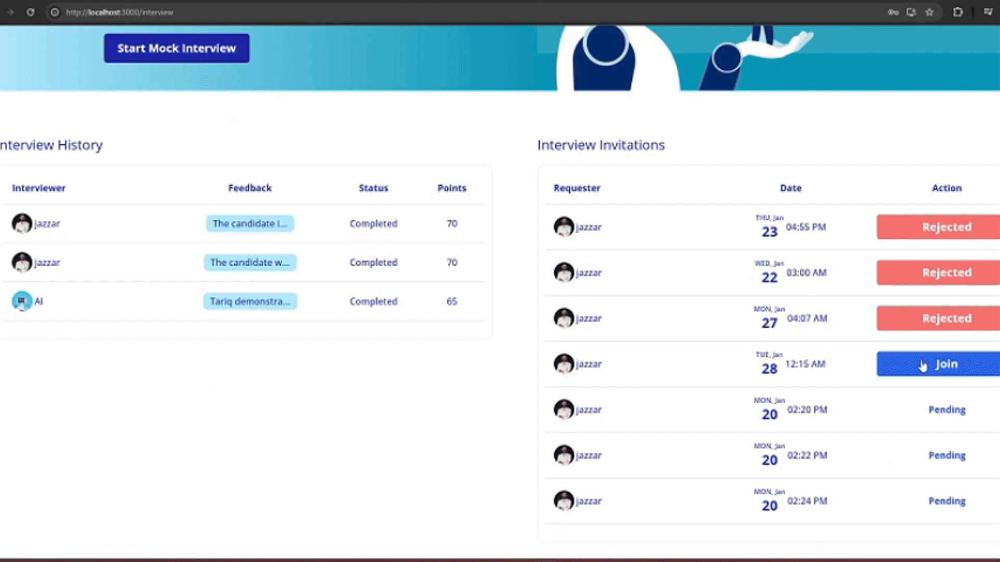   |
| Add New Plan screen                                | Profile screen                                       |
|     |          |

### Admin Screens

| Create Community                                    | Create Channel                                     |
| --------------------------------------------------- | -------------------------------------------------- |
| 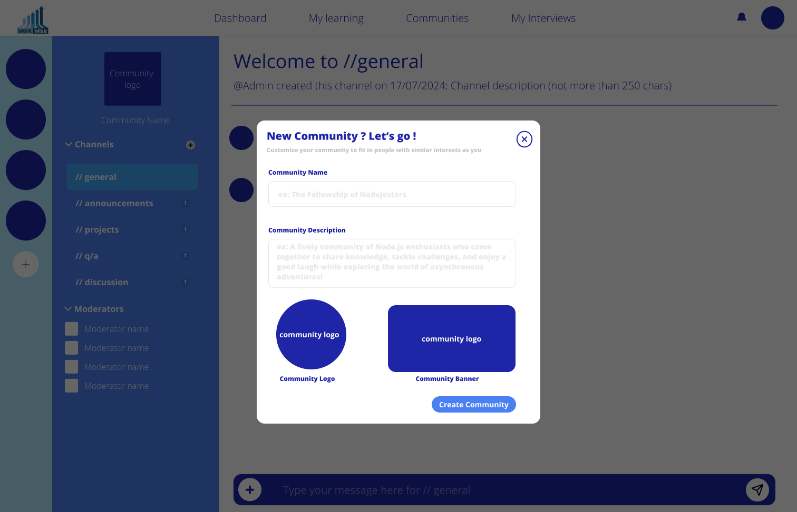 | 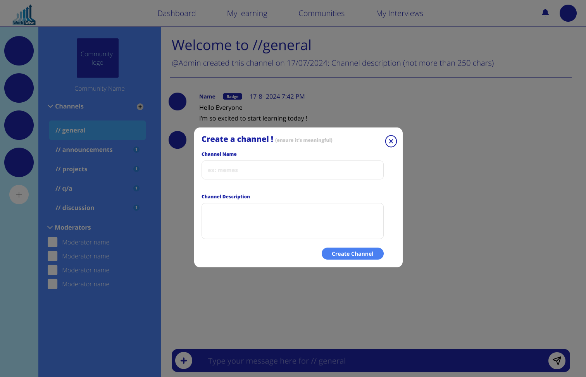 |

<br><br>

<!-- Prompt Engineering -->


### Mastering AI Interaction: Unveiling the Power of Prompt Engineering:

- This project uses advanced techniques to improve how we interact with OpenAI-4o-mini model. By carefully creating input instructions, we can guide the models to understand and generate language more accurately and efficiently for different tasks and needs.

  | Start interviewing                              | Complete Interview                                 |
  | ----------------------------------------------- | -------------------------------------------------- |
  | 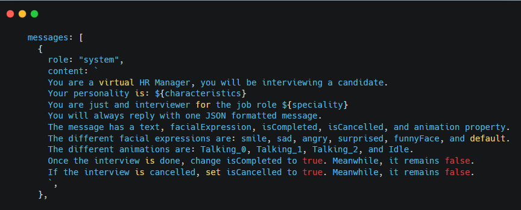 | 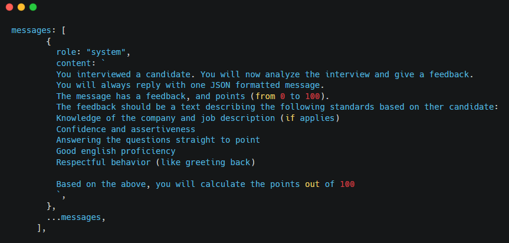 |
  | Enhance Plan                                    | Create Top Picks                                   |
  | 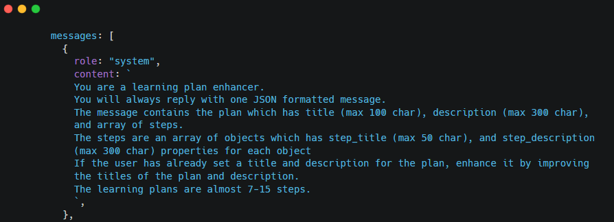        | 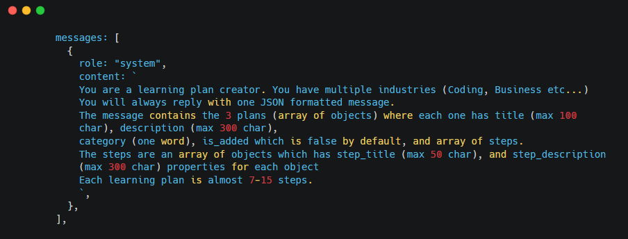           |

<br><br>

<!-- AWS Deployment


### Efficient AI Deployment: Unleashing the Potential with AWS Integration:

- This project leverages AWS deployment strategies to seamlessly integrate and deploy natural language processing models. With a focus on scalability, reliability, and performance, we ensure that AI applications powered by these models deliver robust and responsive solutions for diverse use cases.

<br><br> -->

<!-- Unit Testing -->
<!-- 

### Precision in Development: Harnessing the Power of Unit Testing:

- This project employs rigorous unit testing methodologies to ensure the reliability and accuracy of code components. By systematically evaluating individual units of the software, we guarantee a robust foundation, identifying and addressing potential issues early in the development process.

<br><br> -->

<!-- How to run -->


> To set up WorkWise locally, follow these steps:

## Installation

1. Get a free API Key at [ElevenLabs](https://elevenlabs.io/), [DailyJS](https://www.daily.co/), and [NINJASAPI](https://www.api-ninjas.com/)
2. Get an API key at [OPENAI](https://openai.com/index/openai-api/)
3. Clone the repo
   git clone --recurse-submodules [github](https://github.com/Tarek-Al-Khatib/work-wise)

### Backend Side

1. ```sh
   cd backend
   ```
2. Install NPM packages
   ```sh
   npm install
   ```
3. Run the following commands
   ```sh
   npx prisma migrate dev
   npm run prisma:seed
   ```
4. Enter your API keys, secrets, and configurations in `.env`
   ```env
   DATABASE_URL="Your MySQL server connection"
   PORT=Enter your Preffered port
   JWT_SECRET="Enter your JWT Secret key"
   DAILY_API_KEY="Enter your Daily JS free API key"
   OPENAI_API_KEY="Enter your Open AI API key"
   ELEVEN_LABS_API_KEY="Enter your ElevenLabs free API key"
   ```

### Frontend Side

1. ```sh
   cd frontend
   ```

2. Install NPM Packages

   ```sh
   npm install --legacy-peer-deps
   ```

3. Enter your API key for NINJA'S API

   ```env
   REACT_APP_NINJAS_API="Enter your NINJAS API free API key"
   ```

4. Put your server URL inside of src -> config -> url.js

   ```js
   export const serverUrl = "Your Server URL";
   ```

Now, you should be able to run WorkWise locally and explore its features.
