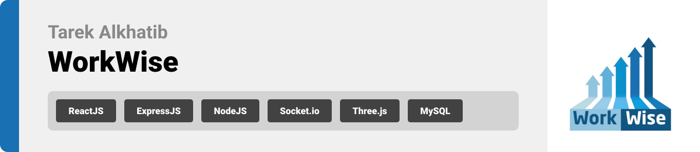
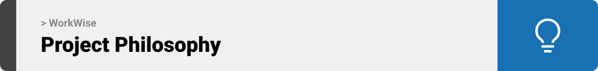
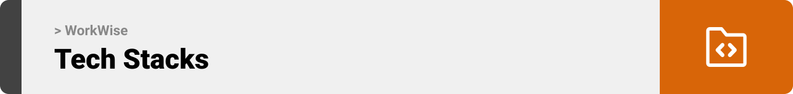
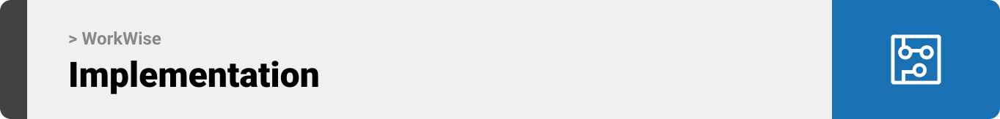
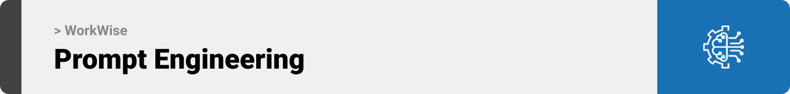
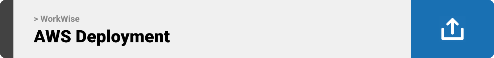

<br><br>

<!-- project philosophy -->


> Workwise is an AI-driven platform designed to empower users in their career growth and development, providing personalized learning paths, mock interview simulations, and community collaboration to help them achieve their professional goals.
>
> The project aims to streamline career advancement by offering tailored learning plans, realistic interview experiences, and fostering a supportive community for networking, mentorship, and skill development. We believe in enhancing career journeys by making learning and professional growth more accessible, engaging, and effective.

## User Stories

### User

- As a user, I want to create a personalized learning plan and track the progress, so I can work towards my career goals step by step.
- As a user, I want to participate in mock interviews with AI or Moderator, so I can practice and improve my interview skills.
- As a user, I want to join a community, so I can collaborate with like-minded individuals and gain mentorship.

### Moderator

- As a moderator, I want to send interview invitations to users, so I can help them prepare for job opportunities.
- As a moderator, I want to review reported messages, so I can take appropriate actions against content that violates community guidelines.
- As a moderator, I am designated as the person users conduct interviews with in the community, ensuring that I can actively support their preparation and provide valuable feedback.

### Admin

- As an admin, I want to assign moderator roles to community members, so I can ensure the community is actively managed and moderated.
- As an admin, I want to create new channels within the community, so users can engage in focused discussions based on specific topics or interests.
- As an admin, I want to edit community details, such as the name, description, or rules, so I can keep the community's information accurate and up-to-date.

<br><br>

<!-- Tech stack -->


### WorkWise is built using the following technologies:

- WorkWise is built using the following technologies:
- The project uses ReactJS for the frontend, enabling an interactive and dynamic user interface.
- For the backend server, it utilizes Node.js with Express.js, providing a robust and scalable API.
- The platform relies on MySQL for relational database management, ensuring efficient data storage and retrieval.
- For real-time features, the project integrates Pusher, enabling live notifications and updates across the platform.
  <br><br>

<!-- UI UX -->


> WorkWise started as simple wireframes and mockups. We kept refining the design, taking feedback at every step, until it felt just right to use, fun to navigate, and perfectly suited to help users grow their careers.

- Project Figma design [figma](https://www.figma.com/design/zplq3EtGiAvkY5so23DcGL/WorkWise-Wireframes?node-id=0-1&t=DDK6dIZuo9VDnyA6-1)

### Mockups

| Home screen                             | Dashboard Screen                      | Profile Screen                        |
| --------------------------------------- | ------------------------------------- | ------------------------------------- |
|  |  |  |

<br><br>

<!-- Database Design -->


### Architecting Data Excellence: Innovative Database Design Strategies:

- Insert ER Diagram here

<br><br>

<!-- Implementation -->


### User Screens (Mobile)

| Login screen                              | Register screen                         | Landing screen                          | Loading screen                          |
| ----------------------------------------- | --------------------------------------- | --------------------------------------- | --------------------------------------- |
|  |  |  |  |
| Home screen                               | Menu Screen                             | Order Screen                            | Checkout Screen                         |
|  |  |  |  |

### Admin Screens (Web)

| Login screen                            | Register screen                       | Landing screen                        |
| --------------------------------------- | ------------------------------------- | ------------------------------------- |
|  |  |  |
| Home screen                             | Menu Screen                           | Order Screen                          |
|  |  |  |

<br><br>

<!-- Prompt Engineering -->


### Mastering AI Interaction: Unveiling the Power of Prompt Engineering:

- This project uses advanced prompt engineering techniques to optimize the interaction with natural language processing models. By skillfully crafting input instructions, we tailor the behavior of the models to achieve precise and efficient language understanding and generation for various tasks and preferences.

<br><br>

<!-- AWS Deployment -->


### Efficient AI Deployment: Unleashing the Potential with AWS Integration:

- This project leverages AWS deployment strategies to seamlessly integrate and deploy natural language processing models. With a focus on scalability, reliability, and performance, we ensure that AI applications powered by these models deliver robust and responsive solutions for diverse use cases.

<br><br>

<!-- Unit Testing -->


### Precision in Development: Harnessing the Power of Unit Testing:

- This project employs rigorous unit testing methodologies to ensure the reliability and accuracy of code components. By systematically evaluating individual units of the software, we guarantee a robust foundation, identifying and addressing potential issues early in the development process.

<br><br>

<!-- How to run -->


> To set up Coffee Express locally, follow these steps:

### Prerequisites

This is an example of how to list things you need to use the software and how to install them.

- npm
  ```sh
  npm install npm@latest -g
  ```

### Installation

_Below is an example of how you can instruct your audience on installing and setting up your app. This template doesn't rely on any external dependencies or services._

1. Get a free API Key at [example](https://example.com)
2. Clone the repo
   git clone [github](https://github.com/your_username_/Project-Name.git)
3. Install NPM packages
   ```sh
   npm install
   ```
4. Enter your API in `config.js`
   ```js
   const API_KEY = "ENTER YOUR API";
   ```

Now, you should be able to run Coffee Express locally and explore its features.
